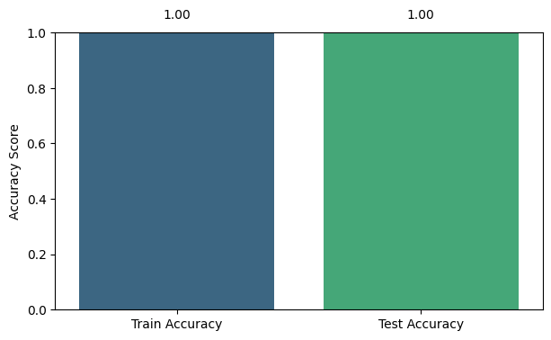
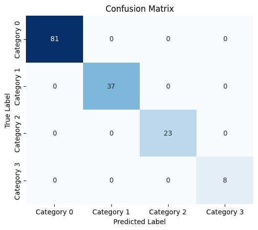

# Crime_legal ⚖️🔍

A machine learning model for **crime type detection** from report/complaint text, using `MLPClassifier` (neural network) and `TF-IDF`.

---

## 📌 Model Output (Labels)

| Label | Meaning |
|:---:|---|
| `0` | Not Criminal |
| `1` | Criminal |
| `2` | Economic |
| `3` | Political |

---

## 🗂️ Dataset

The dataset is included in this repository and contains two columns:

| Column | Type | Description |
|---|---|---|
| `text` | English text | Report or complaint text |
| `label` | Number (0 to 3) | Crime type as shown in the table above |

Example:

```csv
text,label
"He stole money from the company account.",2
"The suspect assaulted a neighbor with a weapon.",1
"He organized an illegal protest against the government.",3
"She helped an elderly person cross the street.",0
```

---

## ⚙️ Requirements

```bash
pip install scikit-learn pandas numpy jupyter
```

Recommended Python version: `3.9+`

---

## 🚀 Installation & Usage

```bash
git clone https://github.com/your-username/Crime_legal.git
cd Crime_legal
pip install -r requirements.txt
jupyter notebook Crime_Legal_Predict.ipynb
```

---

## 🧠 How the Model Works

1. The input text is converted into a numeric vector using a `TF-IDF Vectorizer`.
2. The resulting vector is fed into an `MLPClassifier` (multi-layer neural network).
3. The model outputs one of the numbers `0` to `3`.

---

## ▶️ Usage

```python
from Crime_Legal_Predict import predict

text = "The man was caught bribing a government official."
result = predict(text)

print(result)  # Output: 2 (Economic)
```

---

## 📊 Model Results

| Dataset | Accuracy |
|---|---|
| Train | 1.0 |
| Test | 1.0 |

> Confusion Matrix image generated in the Jupyter Notebook:



### Confusion Matrix

> Confusion Matrix image generated in the Jupyter Notebook:



---

## 📁 Project Structure

```
Crime_legal/
│
├── data/
│   └── crimes.csv
├── Crime_Legal_Predict.ipynb
├── confusion_matrix.png
├── requirements.txt
└── README.md
```

---

## 📄 License

This project is released under the **MIT** license.

---

## 👤 Developer

This project was developed by a single person.
